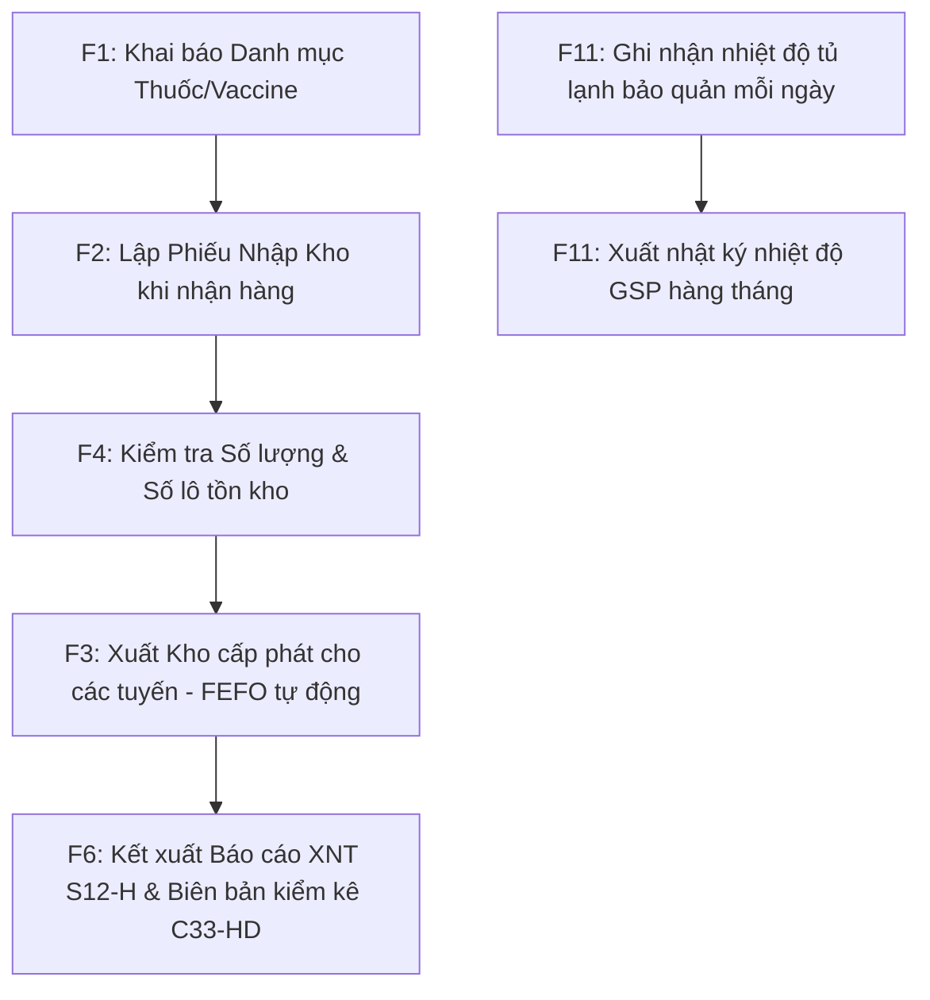

# 📚 HƯỚNG DẪN SỬ DỤNG PHẦN MỀM QUẢN LÝ KHO Y TẾ CDC
### *Hệ thống Quản lý Xuất - Nhập - Tồn Vaccine, Thuốc & Vật tư y tế*

Tài liệu này hướng dẫn chi tiết quy trình vận hành hệ thống phần mềm quản lý kho dành cho Thủ kho và cán bộ quản lý tại Trung tâm Kiểm soát bệnh tật (CDC) và các cơ sở y tế.

---

## 📋 MỤC LỤC
1. [Quy trình nghiệp vụ tổng quan](#1-quy-trình-nghiệp-vụ-tổng-quan)
2. [Hệ thống phím tắt nhanh](#2-hệ-thống-phím-tắt-nhanh)
3. [Hướng dẫn chi tiết từng phân hệ (Tabs)](#3-hướng-dẫn-chi-tiết-từng-phân-hệ-tabs)
   - [F1: Quản lý Sản phẩm & Danh mục](#f1-quản-lý-sản-phẩm--danh-mục)
   - [F2: Lập Phiếu Nhập Kho (C30-HD)](#f2-lập-phiếu-nhập-kho-c30-hd)
   - [F3: Xuất Kho / Cấp phát FEFO (C31-HD)](#f3-xuất-kho--cấp-phát-fefo-c31-hd)
   - [F4: Xem và Quản lý Tồn Kho](#f4-xem-và-quản-lý-tồn-kho)
   - [F5: Cảnh báo Hạn sử dụng](#f5-cảnh-báo-hạn-sử-dụng)
   - [F6: Báo cáo Xuất - Nhập - Tồn (S12-H)](#f6-báo-cáo-xuất---nhập---tồn-s12-h)
   - [F7: Sao lưu & Khôi phục dữ liệu](#f7-sao-lưu--khôi-phục-dữ-liệu)
   - [F8: Thống kê & Báo cáo nâng cao](#f8-thống-kê--báo-cáo-nâng-cao)
   - [F10: Kiểm kho di động bằng Barcode](#f10-kiểm-kho-di-động-bằng-barcode)
   - [F11: Nhật ký Nhiệt độ chuẩn GSP](#f11-nhật-ký-nhiệt-độ-chuẩn-gsp)
4. [Xử lý sự cố thường gặp (Troubleshooting)](#4-xử-lý-sự-cố-thường-gặp-troubleshooting)

---

## 1. Quy trình nghiệp vụ tổng quan

Để vận hành kho CDC hiệu quả, Thủ kho thực hiện theo quy trình chuẩn sau:

---

## 2. Hệ thống phím tắt nhanh

Hệ thống hỗ trợ thao tác nhanh không cần chuột để tối ưu thời gian làm việc:
*   `F1` đến `F8`: Chuyển nhanh qua các tab tương ứng (Sản phẩm -> Báo cáo nâng cao).
*   `F10`: Chuyển nhanh đến tab Kiểm kho di động.
*   `F11`: Chuyển nhanh đến tab Nhật ký nhiệt độ GSP.
*   `F9`: In nhanh phiếu xuất kho PDF của phiếu đang chọn.
*   `Ctrl + F`: Di chuyển con trỏ chuột nhanh đến ô tìm kiếm.
*   `Ctrl + Enter`: Xác nhận lập phiếu cấp phát nhanh (trong tab Xuất kho).

---

## 3. Hướng dẫn chi tiết từng phân hệ (Tabs)

### 🏷️ F1: Quản lý Sản phẩm & Danh mục
Phân hệ này quản lý thông tin các loại Thuốc, Vaccine và Vật tư y tế trong kho.

*   **Sản phẩm trong Danh mục chuẩn**:
    1.  Tại ô **Tên sản phẩm**, gõ từ 2 ký tự trở lên để xem gợi ý tự động từ tệp danh mục của Bộ Y tế (`thuoc.csv`).
    2.  Chọn sản phẩm mong muốn. Hệ thống sẽ tự động điền các thông tin đã chuẩn hóa bao gồm: Tên, Loại sản phẩm, Đơn vị tính và Số đăng ký (nếu có). Các trường này sẽ được khóa để tránh sai lệch danh mục.
    3.  Bấm **Lưu sản phẩm** để đưa vào cơ sở dữ liệu sử dụng.
*   **Sản phẩm ngoài danh mục (Nhập tự do)**:
    1.  Khi sản phẩm không nằm trong danh mục chuẩn, thủ kho có thể tự nhập tay tên sản phẩm mới.
    2.  Hệ thống sẽ mở khóa tất cả các ô để thủ kho tự điền: Đơn vị tính, Số đăng ký, mã Barcode tự do.
    3.  Bấm **Lưu sản phẩm**.

---

### 📦 F2: Lập Phiếu Nhập Kho (C30-HD)
Sử dụng khi CDC nhận vaccine hoặc thuốc từ tuyến trung ương, nhà cung cấp hoặc các nguồn viện trợ.

1.  **Thông tin phiếu nhập**:
    *   **Nguồn cấp/Nhà cung cấp**: Nhập tên đơn vị cấp hàng (hệ thống sẽ tự gợi ý nếu đơn vị đã từng cấp trước đây).
    *   **Ngày nhập**: Chọn ngày nhận hàng thực tế qua lịch chọn ngày.
    *   **Lý do nhập**: Chọn lý do phù hợp (Nhận cấp phát tuyến trên, Mua sắm đấu thầu, Dự án viện trợ...).
2.  **Thêm hàng vào giỏ tạm**:
    *   Chọn sản phẩm cần nhập tại ô chọn sản phẩm.
    *   Điền chi tiết bắt buộc: **Số lô** (Lot No), **Hạn sử dụng** (Expiry Date), **Số lượng** và **Giá nhập**.
    *   Bấm **Nhập hàng** để đưa sản phẩm vào giỏ hàng tạm thời.
3.  **Hoàn thành phiếu**:
    *   Kiểm tra lại toàn bộ giỏ hàng tạm ở bảng danh sách bên dưới (có thể chọn xóa dòng nếu nhập sai).
    *   Bấm **Xác nhận lưu phiếu nhập** ở góc phải để ghi nhận chính thức vào kho. Hệ thống sẽ tự động xuất file PDF Phiếu nhập kho mẫu C30-HD của Bộ Tài chính và mở lên cho thủ kho in ấn.

---

### 📤 F3: Xuất Kho / Cấp phát FEFO (C31-HD)
Sử dụng khi xuất thuốc, vaccine cấp phát cho các Trung tâm y tế huyện, Trạm y tế xã hoặc các bệnh viện.

1.  **Thêm sản phẩm cần xuất**:
    *   Tìm và chọn sản phẩm cần cấp phát.
    *   Nhập số lượng yêu cầu xuất và bấm **Thêm vào giỏ**.
    *   *Lưu ý nghiệp vụ*: Hệ thống vận hành theo cơ chế tự động **FEFO** (Hạn dùng gần nhất xuất trước). Khi thủ kho yêu cầu xuất 100 lọ vaccine, hệ thống sẽ tự động trừ từ các lô có hạn dùng gần nhất trước, nếu thiếu sẽ tự động trừ tiếp sang lô có hạn dùng xa hơn. Thủ kho không cần phải tự chọn lô bằng tay.
2.  **Thông tin phiếu xuất**:
    *   **Đơn vị nhận**: Nhập tên cơ sở y tế nhận hàng (ví dụ: *TYT Phường An Khánh*).
    *   **Ngày xuất**: Chọn ngày xuất (có thể lùi ngày nếu cần lập phiếu hồi tố).
    *   **Lý do xuất**: Chọn lý do (Cấp phát chương trình tiêm chủng, Viện trợ, Thanh lý...).
3.  **Xác nhận xuất**:
    *   Bấm **Xác nhận xuất & In PDF** để ghi sổ. Hệ thống sẽ lập tức tạo file PDF Phiếu xuất kho mẫu C31-HD với bảng chữ ký 5 bên chuẩn mực và tự động mở lên bằng trình đọc PDF.

---

### 📊 F4: Xem và Quản lý Tồn Kho
Giúp thủ kho giám sát lượng tồn kho thực tế của từng sản phẩm tại mọi thời điểm.

*   Bảng hiển thị tổng hợp: Tên sản phẩm, Đơn vị tính cơ sở, Số lượng tồn kho tổng cộng, Số lượng tồn thực tế chia nhỏ theo từng **Số lô** và **Hạn sử dụng** tương ứng.
*   Tích hợp thanh tìm kiếm nhanh ở phía trên để tìm kiếm sản phẩm theo tên hoặc mã barcode.

---

### ⏰ F5: Cảnh báo Hạn sử dụng
Giúp phát hiện sớm các lô hàng sắp hết hạn dùng để có phương án điều chuyển hoặc tiêu hủy.

*   Hệ thống tự động phân loại các lô hàng thành 3 nhóm màu sắc:
    *   🔴 **Hết hạn sử dụng** (Màu đỏ): Các lô đã quá hạn dùng tính đến ngày hiện tại. Hệ thống sẽ chặn không cho phép xuất các lô này.
    *   🟡 **Cận hạn dùng dưới 6 tháng** (Màu cam): Các lô cần ưu tiên lập kế hoạch cấp phát gấp.
    *   🟢 **Hạn dùng an toàn trên 6 tháng** (Màu xanh).
*   Thủ kho có thể lọc nhanh danh sách theo từng nhóm để báo cáo lãnh đạo.

---

### 📄 F6: Báo cáo Xuất - Nhập - Tồn (S12-H)
Phân hệ kết xuất báo cáo và thực hiện kiểm kê kho định kỳ.

*   **Báo cáo Xuất - Nhập - Tồn (Sổ thẻ kho)**:
    1.  Chọn khoảng thời gian cần kết xuất (Từ ngày - Đến ngày).
    2.  Bấm **Báo cáo XNT (PDF)** để xuất tệp PDF theo mẫu quy định **S12-H** ban hành theo Thông tư 107. Báo cáo thống kê chi tiết số lượng Đầu kỳ - Nhập trong kỳ - Xuất trong kỳ - Tồn cuối kỳ chi tiết cho từng số lô/hạn dùng.
    3.  Thủ kho cũng có thể chọn **Xuất Excel** hoặc **Xuất CSV** để lưu trữ và chỉnh sửa thêm.
*   **Biên bản kiểm kê kho (C33-HD)**:
    1.  Bấm nút **Biên bản kiểm kê (PDF)** ở góc phải.
    2.  Hệ thống sẽ kết xuất file PDF mẫu Biên bản kiểm kê kho tại thời điểm hiện tại. Báo cáo này để trống cột "Số lượng thực tế" để hội đồng kiểm kê điền tay trong quá trình đếm kho trực tiếp.

---

### 💾 F7: Sao lưu & Khôi phục dữ liệu
Đảm bảo an toàn tuyệt đối cho dữ liệu kho y tế CDC của đơn vị.

*   **Sao lưu (Backup)**:
    *   *Sao lưu tự động*: Hệ thống tự động sao lưu dữ liệu sang thư mục `backups` vào lúc 23:00 hàng ngày.
    *   *Sao lưu thủ công*: Bấm nút **Sao lưu dữ liệu**, chọn vị trí lưu an toàn (khuyên dùng lưu vào USB hoặc ổ đĩa D).
*   **Khôi phục (Restore)**:
    *   Khi có sự cố hỏng máy tính, thủ kho cài đặt lại phần mềm, chọn **Khôi phục dữ liệu** và tìm đến tệp tin backup `.db` gần nhất để khôi phục toàn bộ dữ liệu cũ.

---

### 📈 F8: Thống kê & Báo cáo nâng cao
Trực quan hóa hoạt động của kho y tế thông qua các biểu đồ số liệu trực quan.

*   **Cấp phát theo ngày**: Thống kê tổng giá trị và số lượng vaccine/thuốc cấp phát ra theo dòng thời gian.
*   **Thống kê theo đơn vị nhận**: Xem biểu đồ hình quạt/cột hiển thị đơn vị nào nhận nhiều hàng nhất (phục vụ báo cáo phân phối vaccine định kỳ cho Sở Y tế).
*   **Top sản phẩm cấp phát**: Liệt kê danh sách các loại vaccine/thuốc có tần suất sử dụng cao nhất.
*   *Ghi chú*: Tất cả các bảng biểu và đồ thị đều hỗ trợ kết xuất trực tiếp ra file ảnh hoặc tệp báo cáo Excel.

---

### 📱 F10: Kiểm kho di động bằng Barcode
Tính năng cho phép thủ kho dùng điện thoại di động làm thiết bị quét mã vạch kiểm kho nhanh chóng mà không cần mua máy quét chuyên dụng.

1.  Bấm nút **Khởi động Server quét di động**. Hệ thống sẽ hiển thị một mã QR Code cùng địa chỉ IP kết nối (ví dụ: `http://192.168.1.75:5000`).
2.  Dùng điện thoại kết nối chung mạng Wi-Fi với máy tính quét mã QR này để truy cập trang quét mã.
3.  *Hướng dẫn cấp quyền Camera trên Android/Chrome (bắt buộc)*:
    - Truy cập `chrome://flags/#unsafely-treat-insecure-origin-as-secure` trên Chrome điện thoại.
    - Tìm mục **Insecure origins treated as secure**, chuyển sang **Enabled**.
    - Nhập địa chỉ hiển thị trên máy tính vào ô bên cạnh (ví dụ: `http://192.168.1.75:5000`).
    - Khởi động lại Chrome và cho phép camera để bắt đầu quét mã.

---

### 🌡️ F11: Nhật ký Nhiệt độ chuẩn GSP
Phần hành quan trọng đáp ứng điều kiện bảo quản vắc xin nghiêm ngặt theo tiêu chuẩn Thực hành tốt bảo quản thuốc.

1.  **Ghi chép hàng ngày**:
    *   Chọn **Ngày theo dõi** (mặc định là hôm nay).
    *   Chọn **Buổi** (Sáng hoặc Chiều).
    *   Chọn vị trí thiết bị bảo quản (ví dụ: *Tủ vaccine 1 (2-8°C)*, *Kho mát VTYT (15-25°C)* hoặc tự gõ vị trí mới).
    *   Nhập **Nhiệt độ (°C)** và **Độ ẩm (%)**.
    *   Nhập tên **Người ghi nhận** và bấm **Lưu chỉ số**.
2.  **Cảnh báo tự động**:
    *   Nếu tủ vắc xin ghi nhận nhiệt độ < 2.0°C hoặc > 8.0°C, hệ thống sẽ phát cảnh báo lệch nhiệt độ ngay trên màn hình và đánh dấu dòng nhật ký bằng màu đỏ đậm. Thủ kho cần chuyển ngay vắc xin sang tủ dự phòng và liên hệ kỹ thuật viên.
3.  **Vẽ biểu đồ xu hướng**:
    *   Chọn tủ lạnh/kho lạnh cụ thể và bấm **Vẽ biểu đồ xu hướng** để quan sát đường đồ thị dao động nhiệt độ tháng, đối chiếu với các đường giới hạn an toàn.
4.  **Xuất báo cáo PDF tháng**:
    *   Bấm **Xuất PDF Sổ nhật ký**. Chọn vị trí lưu file PDF.
    *   Hệ thống sẽ kết xuất Sổ nhật ký theo dõi nhiệt độ A4 ngang chuẩn GSP dùng để trình ký lưu trữ định kỳ hàng tháng phục vụ các đoàn kiểm tra của Bộ Y tế / Sở Y tế.

---

## 4. Xử lý sự cố thường gặp (Troubleshooting)

| Sự cố | Nguyên nhân | Biện pháp xử lý |
| :--- | :--- | :--- |
| **Phần mềm báo lỗi File Not Found khi chạy .exe** | Thiếu file DLL đi kèm của thư viện quét mã vạch `pyzbar`. | Sử dụng file đóng gói chuẩn bằng cách chạy tệp `build.bat` để đảm bảo hệ thống copy đầy đủ tệp `libiconv.dll` và `libzbar-64.dll`. |
| **Không mở được camera điện thoại để quét barcode** | Trình duyệt Chrome trên điện thoại chặn camera do trang web không sử dụng giao thức bảo mật HTTPS. | Làm theo hướng dẫn tại Tab F10, cấu hình Chrome Flags để đưa địa chỉ IP máy tính vào danh sách ngoại lệ an toàn (*Insecure origins treated as secure*). |
| **Không xuất được báo cáo PDF** | Máy tính chưa được cài đặt thư viện hỗ trợ `reportlab`. | Phần mềm sẽ tự động phát hiện và hỏi ý kiến cài đặt tự động. Bấm **Đồng ý (Yes)** và giữ kết nối Internet trong 5 giây để hệ thống tự cài đặt qua `pip`. |
| **Thông tin số liệu tồn kho bị sai lệch** | Thủ kho xóa nhầm hoặc sửa chữa các phiếu xuất/nhập cũ không đúng quy trình dẫn tới lệch lô. | Vào tab **F7: Sao lưu**, chọn khôi phục lại dữ liệu từ tệp sao lưu của ngày hôm trước để đưa dữ liệu về trạng thái an toàn. |

---
**Bộ tài liệu hướng dẫn sử dụng vận hành kho CDC - Phiên bản 2.0.0**
